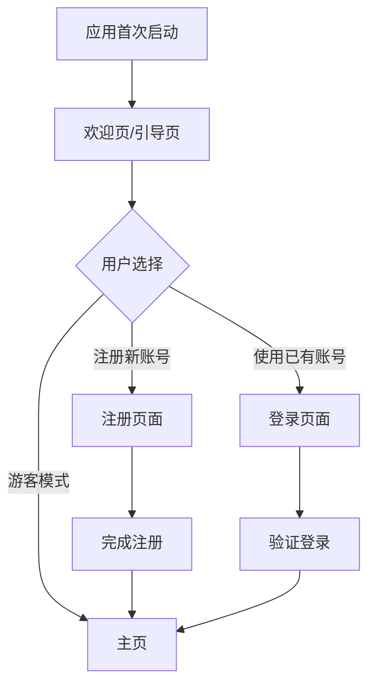
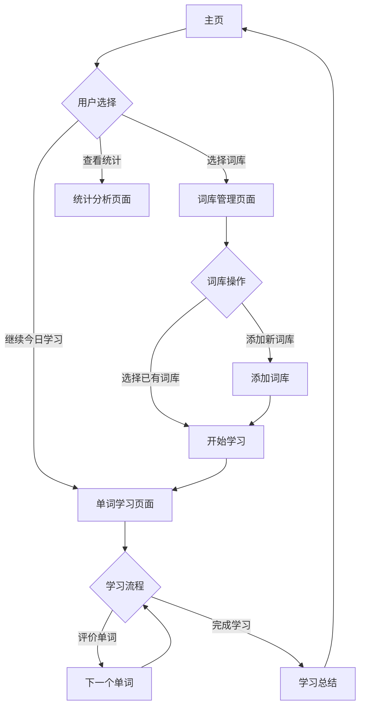
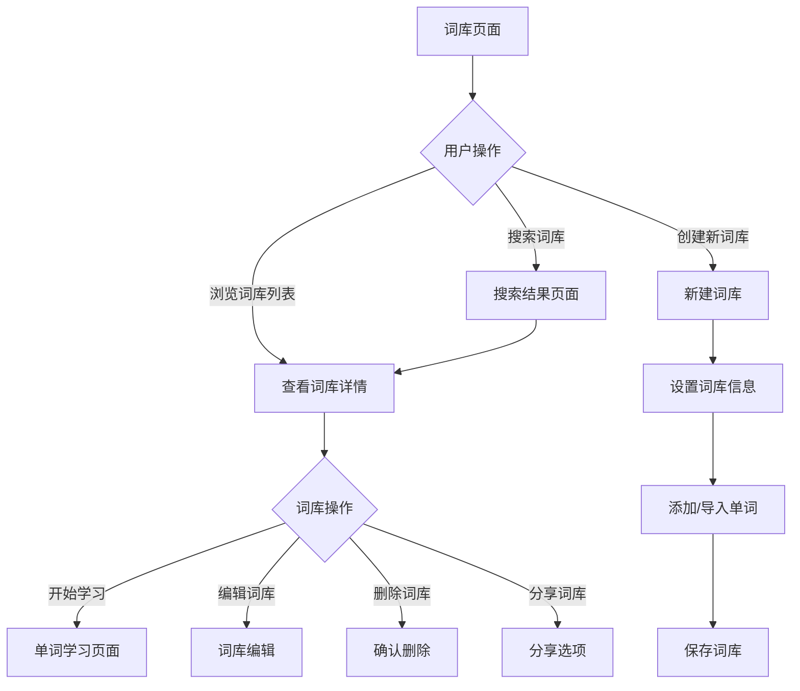
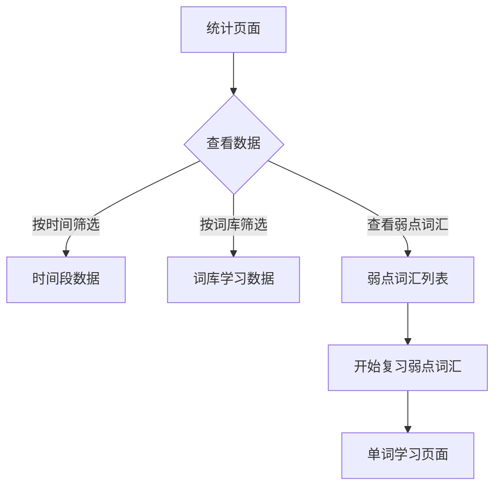
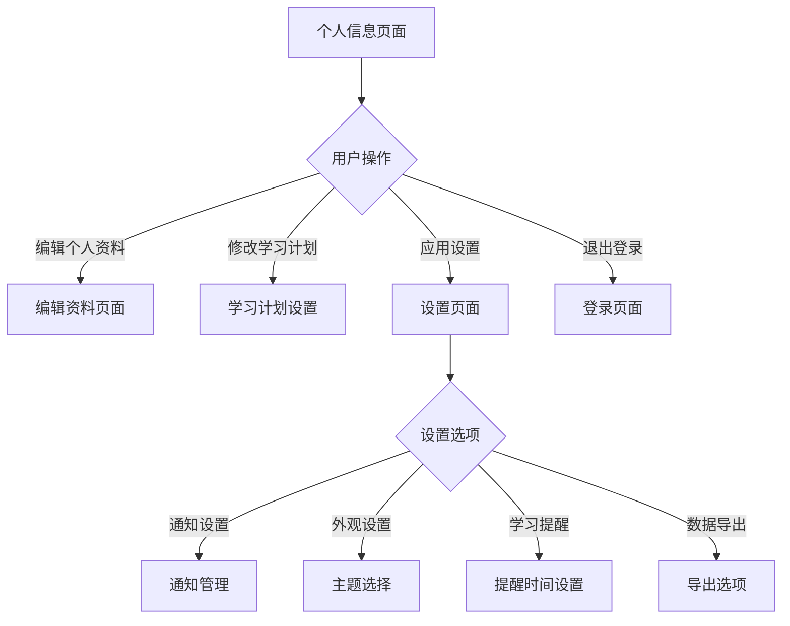

# xpro 语言学习应用 - 用户操作流程图

## 1. 首次使用流程

```mermaid
flowchart TD
    A[应用首次启动] --> B[欢迎页/引导页]
    B --> C{用户选择}
    C -->|注册新账号| D[注册页面]
    C -->|使用已有账号| E[登录页面]
    C -->|游客模式| F[主页]
    D --> G[完成注册]
    E --> H[验证登录]
    G --> F
    H --> F
```

## 2. 学习流程

```mermaid
flowchart TD
    A[主页] --> B{用户选择}
    B -->|选择词库| C[词库管理页面]
    B -->|继续今日学习| D[单词学习页面]
    B -->|查看统计| E[统计分析页面]
    
    C --> F{词库操作}
    F -->|添加新词库| G[添加词库]
    F -->|选择已有词库| H[开始学习]
    G --> H
    
    H --> D
    D --> I{学习流程}
    I -->|评价单词| J[下一个单词]
    I -->|完成学习| K[学习总结]
    J --> I
    
    K --> A
```

## 3. 词库管理流程

```mermaid
flowchart TD
    A[词库页面] --> B{用户操作}
    B -->|浏览词库列表| C[查看词库详情]
    B -->|搜索词库| D[搜索结果页面]
    B -->|创建新词库| E[新建词库]
    
    C --> F{词库操作}
    F -->|开始学习| G[单词学习页面]
    F -->|编辑词库| H[词库编辑]
    F -->|删除词库| I[确认删除]
    F -->|分享词库| J[分享选项]
    
    E --> K[设置词库信息]
    K --> L[添加/导入单词]
    L --> M[保存词库]
    
    D --> C
```

## 4. 统计分析流程

```mermaid
flowchart TD
    A[统计页面] --> B{查看数据}
    B -->|按时间筛选| C[时间段数据]
    B -->|按词库筛选| D[词库学习数据]
    B -->|查看弱点词汇| E[弱点词汇列表]
    
    E --> F[开始复习弱点词汇]
    F --> G[单词学习页面]
```

## 5. 设置与个人信息流程

```mermaid
flowchart TD
    A[个人信息页面] --> B{用户操作}
    B -->|编辑个人资料| C[编辑资料页面]
    B -->|修改学习计划| D[学习计划设置]
    B -->|应用设置| E[设置页面]
    B -->|退出登录| F[登录页面]
    
    E --> G{设置选项}
    G -->|通知设置| H[通知管理]
    G -->|外观设置| I[主题选择]
    G -->|学习提醒| J[提醒时间设置]
    G -->|数据导出| K[导出选项]
``` 