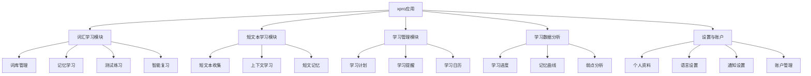
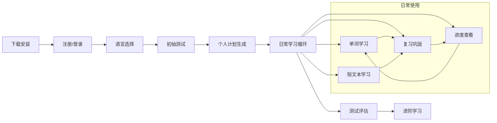
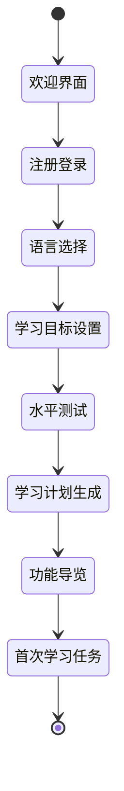
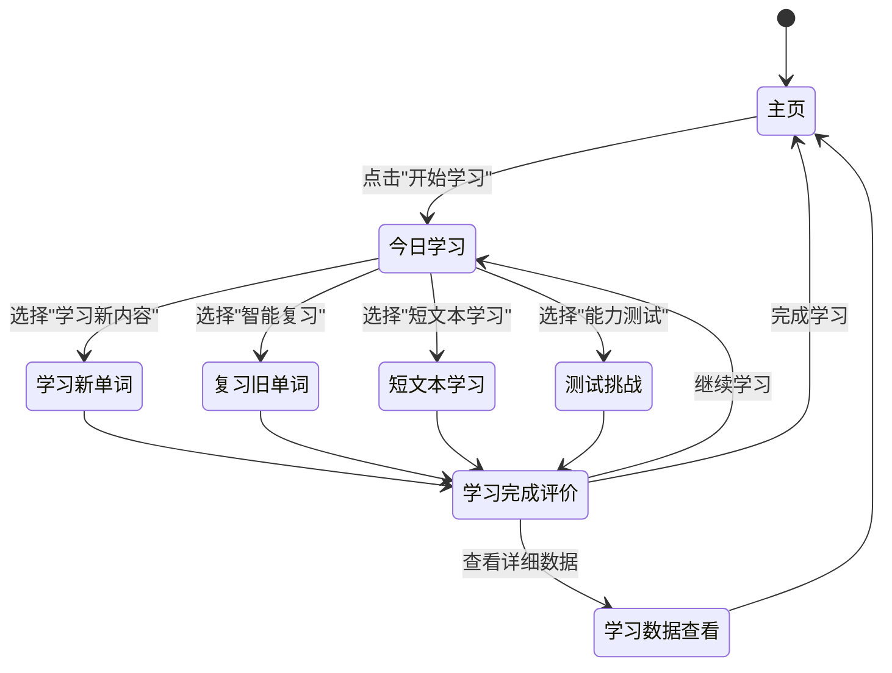
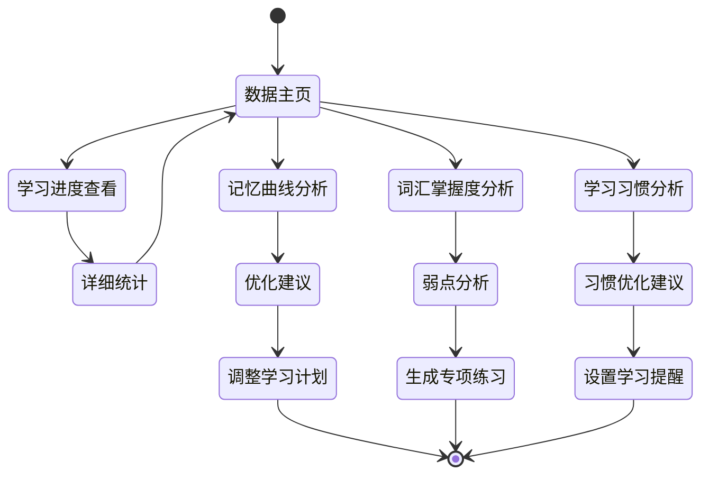
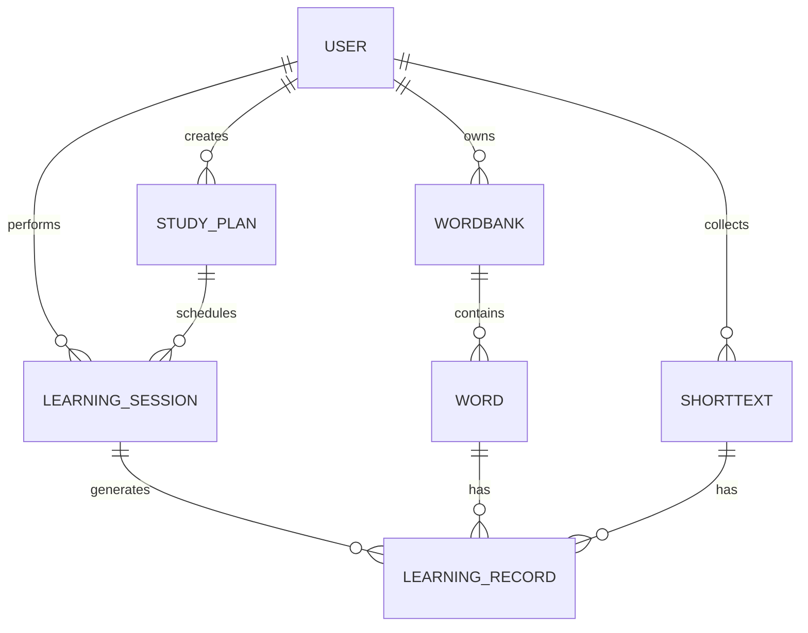

# xpro - 语言学习应用产品需求文档(PRD)

## 1. 文档信息
### 1.1 版本历史
| 版本号 | 日期 | 修改说明 | 作者 |
|-------|------|---------|------|
| v0.1 | 2024-07-XX | 初始草案 | 产品团队 |

### 1.2 文档目的
本文档旨在详细描述xpro语言学习应用的产品需求，为设计、开发、测试等团队提供明确的产品规划指导。

### 1.3 相关文档引用
- 产品路线图 (docs/Roadmap.md)
- 用户故事地图 (docs/User_Story_Map.md)
- 产品评估指标框架 (docs/Metrics_Framework.md)

## 2. 产品概述
### 2.1 产品名称与定位
- **产品名称**: xpro
- **产品定位**: 一款面向学生群体的多语言学习应用，专注于单词和短文本的记忆与掌握，通过科学的学习方法提高语言学习效率。

### 2.2 产品愿景与使命
- **愿景**: 成为学生首选的语言学习工具，让语言学习变得高效、有趣且有成就感。
- **使命**: 通过科学的记忆方法和个性化学习路径，帮助学生突破语言学习障碍，实现语言能力的快速提升。

### 2.3 价值主张与独特卖点(USP)
- 科学的间隔重复学习系统，优化记忆效率
- 支持多语言学习，满足不同学习需求
- 同时支持单词和短文本学习，提供完整的语言学习解决方案
- 针对学生群体的个性化学习路径和内容推荐
- 简洁高效的用户界面，减少学习干扰

### 2.4 目标平台列表
- iOS 移动应用
- Android 移动应用

### 2.5 产品核心假设
- 学生用户在语言学习过程中，记忆单词和短语是最大的痛点之一
- 科学的记忆方法(如间隔重复、记忆曲线)能显著提高学习效率
- 学生用户偏好简洁、专注的学习工具，而非功能过于复杂的应用
- 多语言支持将扩大用户基础并提高应用竞争力

### 2.6 商业模式概述
- 基础功能免费使用
- 高级功能(如高级学习数据分析、更多语言包、特殊学习模式)采用订阅制
- 可选的一次性付费语言包

## 3. 用户研究
### 3.1 目标用户画像 (详细)
#### 3.1.1 人口统计特征
- **主要用户**: 15-25岁的中学生和大学生
- **教育水平**: 中学至大学阶段
- **地理分布**: 全球范围，尤其是语言学习需求高的国家和地区
- **经济状况**: 中等收入家庭，有一定的教育投入能力但对价格敏感

#### 3.1.2 行为习惯与偏好
- **学习习惯**: 日常碎片化学习为主，考试前集中学习为辅
- **使用场景**: 通勤时间、课间休息、睡前学习
- **设备偏好**: 智能手机为主，平板电脑为辅
- **学习频率**: 每天10-30分钟的短时间学习，考试前集中使用
- **社交偏好**: 喜欢与同学朋友分享学习进度和成果

#### 3.1.3 核心需求与痛点
**核心需求**:
- 高效记忆大量单词和短语
- 短时间内提高语言考试成绩
- 科学管理学习进度和计划
- 获得即时学习反馈

**主要痛点**:
- 单纯背诵单词枯燥乏味，难以坚持
- 传统记忆方法效率低下，遗忘率高
- 难以评估自己的学习效果和进度
- 学习材料不够针对性，与考试不匹配
- 学习时间分散，难以形成系统学习

#### 3.1.4 动机与目标
- **短期目标**: 应对语言考试、完成课程作业
- **中期目标**: 掌握特定领域词汇，提高语言能力
- **长期目标**: 达到语言流利使用水平，提升学术/职业竞争力
- **内在动机**: 获得成就感、提高自信心
- **外在动机**: 获得好成绩、通过考试认证

### 3.2 用户场景分析
#### 3.2.1 核心使用场景详述
1. **日常碎片化学习**
   - 通勤路上利用15分钟复习单词
   - 课间休息时进行5-10分钟的快速学习
   - 睡前进行20分钟的单词复习

2. **考试前集中备考**
   - 考试前一个月开始系统学习特定词汇库
   - 每天规划1-2小时的学习计划
   - 重点关注易错词和难点词汇

3. **课程学习辅助**
   - 配合学校课程进度学习相关词汇
   - 根据课本章节创建专属词库
   - 与课程学习同步进行词汇积累

4. **自主拓展学习**
   - 根据兴趣领域学习专业词汇
   - 通过短文学习词汇在语境中的应用
   - 针对弱项进行专项强化训练

#### 3.2.2 边缘使用场景考量
1. **跨语言学习者**
   - 同时学习多种语言的用户
   - 在不同语言间寻找联系和规律

2. **学习障碍用户**
   - 有阅读障碍或其他学习障碍的用户
   - 需要特殊学习方法辅助

3. **教师辅助教学**
   - 老师为学生创建定制词库
   - 监控学生学习进度和成果

4. **团队/班级共同学习**
   - 班级共享词库和学习进度
   - 小组竞赛激励学习

### 3.3 用户调研洞察
- 学生用户普遍反映单词记忆是语言学习最大障碍
- 用户对学习方法的科学性和有效性高度关注
- 简洁直观的界面比华丽复杂的设计更受欢迎
- 即时反馈和成就感是维持学习动力的关键
- 社交元素和竞争机制能有效提高用户参与度和留存率 

## 4. 市场与竞品分析
### 4.1 市场规模与增长预测
- 全球语言学习应用市场规模预计2023年达到约150亿美元，年增长率约15%
- 移动语言学习应用渗透率持续增长，特别是在亚太地区和欧洲市场
- 疫情后远程学习和自主学习需求持续增长，促进了语言学习应用市场扩大
- 学生群体是语言学习应用的最大用户群体之一，占比约45%

### 4.2 行业趋势分析
- **个性化学习**: AI驱动的个性化学习路径和内容推荐成为主流
- **微学习**: 短时间、高频次的学习模式越来越受欢迎
- **多模态学习**: 结合视觉、听觉等多种感官的学习方式效果更佳
- **数据驱动**: 学习数据分析和可视化成为产品竞争力的关键
- **社交学习**: 社区互动和社交激励机制成为提高用户粘性的重要手段
- **语音识别与AI**: 自然语言处理技术在语言学习中的应用日益广泛

### 4.3 竞争格局分析
#### 4.3.1 直接竞争对手详析
1. **Duolingo**
   - **优势**: 游戏化体验强，免费内容丰富，社区活跃
   - **劣势**: 单词记忆系统不够系统，学习路径较固定
   - **定价**: 免费+订阅制(月费约10美元)
   - **特色**: 丰富的游戏化元素，多语言学习

2. **Memrise**
   - **优势**: 记忆方法科学，视频内容丰富，真实场景学习
   - **劣势**: 界面较复杂，学习路径不够清晰
   - **定价**: 免费+订阅制(月费约8.99美元)
   - **特色**: 记忆宫殿技术，真人视频

3. **Anki**
   - **优势**: 间隔重复系统强大，高度自定义，开源免费(部分平台)
   - **劣势**: 界面不友好，学习曲线陡峭
   - **定价**: 部分平台免费，iOS收费约25美元一次性购买
   - **特色**: 强大的间隔重复算法，高度自定义

4. **Quizlet**
   - **优势**: 用户创建内容丰富，多种学习模式
   - **劣势**: 记忆算法不够先进，内容质量参差不齐
   - **定价**: 免费+订阅制(月费约7.99美元)
   - **特色**: 用户生成内容平台，多种学习工具

#### 4.3.2 间接竞争对手概述
1. **综合语言学习平台**
   - 如Babbel、Rosetta Stone等，提供更全面的语言学习体验
   - 价格通常较高，内容更加系统化

2. **词典应用**
   - 如有道词典、欧路词典等，主要功能是查询而非系统学习
   - 通常有单词本功能但记忆系统较简单

3. **传统纸质教材与辅导**
   - 传统单词书和课堂教学依然占有市场份额
   - 体验不够交互，难以提供个性化学习路径

4. **AI语言学习助手**
   - 如AI语言教练，通过对话式学习进行训练
   - 尚处于发展初期，用户习惯养成中

### 4.4 竞品功能对比矩阵
| 功能/特性 | xpro | Duolingo | Memrise | Anki | Quizlet |
|-----------|------|----------|---------|------|---------|
| 间隔重复系统 | ★★★★★ | ★★★ | ★★★★ | ★★★★★ | ★★ |
| 多语言支持 | ★★★★ | ★★★★★ | ★★★★ | ★★★★★ | ★★★★ |
| 短文本学习 | ★★★★★ | ★★★ | ★★★ | ★★★★ | ★★ |
| 用户界面友好度 | ★★★★★ | ★★★★ | ★★★ | ★★ | ★★★★ |
| 自定义学习内容 | ★★★★ | ★★ | ★★★ | ★★★★★ | ★★★★ |
| 学习数据分析 | ★★★★ | ★★★ | ★★ | ★★★ | ★★ |
| 社交功能 | ★★★ | ★★★★★ | ★★ | ★ | ★★★ |
| 离线学习支持 | ★★★★★ | ★★★ | ★★★★ | ★★★★★ | ★★★ |
| 免费内容丰富度 | ★★★★ | ★★★★★ | ★★★ | ★★★★★ | ★★★★ |
| 学习路径清晰度 | ★★★★★ | ★★★★ | ★★★ | ★★ | ★★★ |

### 4.5 市场差异化策略
1. **学生专属定位**
   - 与通用语言学习应用区别，专注满足学生群体特定需求
   - 提供与学校课程、考试对接的专业词库和学习路径

2. **科学记忆系统**
   - 采用先进的间隔重复算法，优于市场上大多数应用
   - 将记忆科学理论与实际学习体验无缝结合

3. **短文本学习优势**
   - 不仅支持单词记忆，还提供短语、句子和段落的记忆学习
   - 提供语境化学习，促进单词在实际应用中的掌握

4. **学习方法指导**
   - 不只提供学习工具，还教授有效的记忆方法和学习技巧
   - 培养用户良好的学习习惯和方法

5. **极简高效设计**
   - 专注于核心功能，减少无关干扰
   - 提供清晰的学习路径和反馈机制 

## 5. 产品功能需求
### 5.1 功能架构与模块划分

### 5.2 核心功能详述
#### 5.2.1 词汇学习模块
##### 词库管理
- **功能描述**: 作为用户，我想要创建、导入、编辑和管理我的词库，以便有效组织我需要学习的单词。
- **用户价值**: 灵活管理学习内容，适应不同学习场景和需求。
- **功能逻辑与规则**:
  - 支持创建个人词库，可设置名称、描述、语言类型等
  - 提供预设词库(基础词汇、考试词汇、专业词汇等)
  - 支持通过文件(CSV, Excel, TXT)导入词库
  - 支持词库分类、标签管理
  - 支持词库共享、收藏他人词库
  - 每个词条包含：单词、释义、例句、发音、图片(可选)、难度级别
- **交互要求**:
  - 词库列表视图支持快速预览和操作
  - 提供直观的词库编辑界面
  - 批量导入时提供验证和预览功能
- **数据需求**:
  - 词库元数据：名称、描述、创建时间、更新时间、语言类型、词汇数量
  - 词条数据：单词、释义、例句、发音文件路径、图片路径、难度级别、学习状态
- **技术依赖**:
  - 本地数据库存储
  - 云端同步服务
  - 文件解析器
- **验收标准**:
  - 用户能成功创建词库并添加单词
  - 成功导入不同格式的词库文件
  - 词库数据能正确同步到云端
  - 用户能通过搜索快速找到特定词库

##### 记忆学习
- **功能描述**: 作为用户，我想要通过科学的记忆方法学习单词，以便高效记住单词并减少遗忘。
- **用户价值**: 提高记忆效率，减少学习时间，增强记忆保持率。
- **功能逻辑与规则**:
  - 基于间隔重复算法(SM-2)的学习系统
  - 学习模式：基础模式(单词-释义)、完整模式(单词-释义-例句-发音)
  - 记忆评级：1-5级评分系统，用户根据记忆情况自评
  - 根据评级动态调整单词的复习间隔
  - 学习会话设计：每次学习15-30个单词，包含新词和复习词
  - 支持多种记忆辅助：形象联想、词根词缀分析、记忆技巧提示
- **交互要求**:
  - 卡片式学习界面，支持左右滑动评级
  - 提供语音播放、减速播放功能
  - 学习过程中显示进度和剩余单词数
  - 完成学习会话后提供简要总结
- **数据需求**:
  - 学习记录：单词ID、学习时间、评级、下次复习时间
  - 记忆状态：熟悉度、稳定性、复习次数
- **技术依赖**:
  - 间隔重复算法库
  - 语音合成引擎
- **验收标准**:
  - 用户能顺利完成学习会话
  - 系统正确根据用户评级安排复习计划
  - 系统能准确跟踪和显示学习进度
  - 单词发音清晰且加载迅速

##### 测试练习
- **功能描述**: 作为用户，我想要通过多种测试方式检验我的记忆成果，以便巩固知识并获得学习反馈。
- **用户价值**: 检验学习成果，识别弱点，增强记忆。
- **功能逻辑与规则**:
  - 测试类型：选择题、拼写题、释义匹配、完形填空
  - 测试范围：可选择特定词库或已学单词
  - 测试难度：根据用户记忆状态动态调整
  - 错题自动收集并加入强化复习
  - 测试结果分析：正确率、速度、弱点词汇
- **交互要求**:
  - 简洁清晰的测试界面
  - 即时反馈正误并显示正确答案
  - 测试完成后提供详细分析报告
- **数据需求**:
  - 测试记录：时间、类型、范围、得分、用时
  - 题目记录：单词ID、题型、回答、正误
- **验收标准**:
  - 各类型测试能正常进行
  - 测试结果准确记录并反映在学习数据中
  - 系统能根据测试结果调整复习计划

##### 智能复习
- **功能描述**: 作为用户，我想要系统智能安排我的复习内容和时间，以便最大化记忆效果。
- **用户价值**: 减轻复习规划负担，优化复习效果。
- **功能逻辑与规则**:
  - 基于遗忘曲线和用户学习数据智能安排复习
  - 每日复习推荐：根据即将遗忘的单词生成复习列表
  - 复习优先级：将遗忘风险高、重要性高的单词优先安排
  - 复习模式多样化：快速复习、深度复习、混合复习
  - 支持"临时抱佛脚"模式：考试前密集复习
- **交互要求**:
  - 直观显示待复习单词数量和预计用时
  - 复习进度实时显示
  - 复习完成后提供成就感反馈
- **数据需求**:
  - 复习计划：单词ID列表、计划复习时间、实际复习时间
  - 复习效果：复习前后记忆状态对比
- **验收标准**:
  - 系统能根据学习数据生成合理的复习计划
  - 用户能轻松查看和执行复习任务
  - 复习数据能正确反映在整体学习进度中

#### 5.2.2 短文本学习模块
##### 短文本收集
- **功能描述**: 作为用户，我想要收集和管理有价值的短文本(短语、句子、段落)，以便在语境中学习词汇。
- **用户价值**: 积累实用语言素材，提高语言应用能力。
- **功能逻辑与规则**:
  - 支持手动添加短文本，可添加标签、难度标记
  - 提供预设短文本库(名人名言、经典段落、实用对话等)
  - 支持从阅读材料中一键收集(复制+分享到App)
  - 短文本分类管理：话题、难度、来源等
  - 每个短文本包含：原文、翻译(可选)、关键词标记、音频(可选)
- **交互要求**:
  - 简洁的收集界面，减少添加步骤
  - 列表/卡片视图切换显示收集的短文本
  - 提供搜索和筛选功能
- **数据需求**:
  - 短文本数据：原文、翻译、添加时间、标签、难度级别
  - 关联单词数据：短文本中包含的关键词列表
- **验收标准**:
  - 用户能快速添加和管理短文本
  - 系统能准确识别和标记短文本中的关键词
  - 收集的短文本能有效组织和检索

##### 上下文学习
- **功能描述**: 作为用户，我想要在语境中学习单词，以便理解单词的实际用法和含义。
- **用户价值**: 提高词汇理解深度，掌握单词在实际语境中的用法。
- **功能逻辑与规则**:
  - 短文本中单词高亮显示，点击可查看释义和发音
  - 提供整句翻译和逐词解析
  - 关联单词可一键添加到个人词库
  - 语境记忆辅助：提供句子结构分析、词汇搭配提示
  - 支持按难度筛选短文本进行学习
- **交互要求**:
  - 短文本阅读界面清晰易读，重点词汇突出显示
  - 单词释义弹窗不干扰整体阅读体验
  - 提供音频播放，支持调整速度和重复播放
- **数据需求**:
  - 学习记录：阅读时间、停留时间、查询词汇
  - 关联数据：短文本与词库的关联
- **验收标准**:
  - 用户能流畅地在语境中查看和学习单词
  - 系统能正确标识和解释短文本中的词汇
  - 上下文学习记录能与单词学习系统有效整合

##### 短文记忆
- **功能描述**: 作为用户，我想要记忆和掌握完整的短文本，以便提高我的语言表达能力。
- **用户价值**: 掌握地道表达，提高语言输出能力。
- **功能逻辑与规则**:
  - 短文本记忆方法：完形填空、听写练习、拼写挑战
  - 记忆难度设置：初级(关键词填空)、中级(多词填空)、高级(重建短文)
  - 支持间隔重复记忆，类似单词记忆系统
  - 提供记忆技巧：关键词联想、句型结构分析
  - 支持录音对比：用户朗读与标准发音对比
- **交互要求**:
  - 记忆练习界面简洁易用
  - 填空练习支持虚拟键盘快速输入
  - 即时反馈正误，提供正确答案展示
  - 完成后显示掌握程度和进步情况
- **数据需求**:
  - 记忆进度：短文本ID、练习次数、正确率、熟悉度
  - 错误记录：常错位置、错误类型分析
- **验收标准**:
  - 用户能通过多种方式练习记忆短文本
  - 系统能准确评估用户对短文本的掌握程度
  - 记忆练习能适应用户水平，提供适当挑战

#### 5.2.3 学习管理模块
##### 学习计划
- **功能描述**: 作为用户，我想要创建和管理我的学习计划，以便有条理地安排学习活动。
- **用户价值**: 建立学习规律，提高学习效率。
- **功能逻辑与规则**:
  - 支持创建多种类型的学习计划：日常计划、考试计划、主题计划
  - 计划参数设置：目标词汇量、每日学习时间、学习周期
  - 智能推荐计划：根据用户目标和时间自动生成最优计划
  - 计划调整：支持进度调整、目标修改
  - 计划执行跟踪：完成率、坚持天数、达成预期
- **交互要求**:
  - 计划创建向导，引导用户设置合理目标
  - 直观的计划进度展示
  - 计划执行提醒和鼓励
- **数据需求**:
  - 计划元数据：名称、类型、开始时间、结束时间、目标
  - 执行数据：每日完成情况、累计进度
- **验收标准**:
  - 用户能创建多种类型的学习计划
  - 系统能准确跟踪和展示计划执行情况
  - 计划能根据用户实际学习情况智能调整

##### 学习提醒
- **功能描述**: 作为用户，我想要接收定制化的学习提醒，以便培养学习习惯并保持学习动力。
- **用户价值**: 建立学习习惯，避免中断学习。
- **功能逻辑与规则**:
  - 提醒类型：定时提醒、智能提醒(基于用户活跃时间)
  - 提醒内容：今日学习任务、待复习单词数、连续学习天数
  - 提醒方式：推送通知、应用内提醒、小组件
  - 激励机制：连续学习奖励、里程碑成就
  - 提醒智能调节：根据用户反应和完成情况调整频率和内容
- **交互要求**:
  - 提醒设置界面简单明了
  - 推送通知内容简洁有吸引力
  - 一键开始学习，减少阻力
- **数据需求**:
  - 提醒设置：时间、频率、类型、开关状态
  - 用户反应数据：点击率、完成率、推迟率
- **验收标准**:
  - 提醒能准时发送且内容正确
  - 用户能方便地自定义提醒设置
  - 提醒能有效促进用户学习活动

##### 学习日历
- **功能描述**: 作为用户，我想要通过日历查看我的学习历史和计划，以便全面了解我的学习情况。
- **用户价值**: 可视化学习历程，增强成就感。
- **功能逻辑与规则**:
  - 日历视图显示：已学习天数、学习时长、单词量
  - 支持日/周/月视图切换
  - 热力图展示：学习强度直观显示
  - 日历事件：考试日期、学习计划里程碑
  - 历史回顾：查看任意日期的学习详情
- **交互要求**:
  - 日历界面简洁美观
  - 支持滑动和点击查看详情
  - 重要日期和里程碑醒目显示
- **数据需求**:
  - 每日学习数据：日期、时长、学习单词数、完成任务
  - 事件数据：类型、日期、描述、优先级
- **验收标准**:
  - 日历能准确显示用户的学习历史
  - 用户能通过日历快速了解学习状况
  - 日历视图能与其他功能模块整合良好

#### 5.2.4 学习数据分析
##### 学习进度
- **功能描述**: 作为用户，我想要查看我的整体学习进度和成果，以便了解我的学习效果。
- **用户价值**: 获得成就感，明确学习方向。
- **功能逻辑与规则**:
  - 整体统计：总学习词汇量、掌握度分布、学习时间
  - 进度展示：各词库学习进度、近期学习趋势
  - 对比分析：与历史自我对比、与同水平用户对比
  - 学习速度和效率分析：记忆保持率、学习效率曲线
  - 成就系统：学习里程碑、等级提升、技能解锁
- **交互要求**:
  - 数据可视化展示，图表清晰易懂
  - 提供多维度分析视角
  - 成就获得时有醒目提示和庆祝动画
- **数据需求**:
  - 汇总数据：各类学习指标的时间序列数据
  - 比较数据：同类用户的匿名统计数据
- **验收标准**:
  - 数据展示准确且实时更新
  - 用户能通过多种维度了解自己的学习情况
  - 成就系统能有效激励用户持续学习

##### 记忆曲线
- **功能描述**: 作为用户，我想要查看我的记忆曲线和遗忘规律，以便优化我的学习策略。
- **用户价值**: 理解个人记忆特点，制定最佳学习计划。
- **功能逻辑与规则**:
  - 记忆曲线绘制：基于用户实际学习数据
  - 遗忘分析：不同类型词汇的遗忘速率对比
  - 记忆周期优化：根据个人数据调整间隔重复周期
  - 最佳学习时间分析：识别用户记忆效率最高的时间段
  - 学习建议：基于分析结果提供个性化学习建议
- **交互要求**:
  - 曲线图表易于理解，提供简洁说明
  - 关键数据点可交互查看详情
  - 优化建议突出显示
- **数据需求**:
  - 记忆测试数据：复习时间点、记忆评级、反应时间
  - 遗忘模型参数：个人化的遗忘曲线参数
- **验收标准**:
  - 记忆曲线分析准确反映用户实际记忆情况
  - 系统能根据分析结果调整学习算法
  - 用户能根据分析结果优化学习策略

##### 弱点分析
- **功能描述**: 作为用户，我想要识别我的学习弱点和难点，以便有针对性地强化学习。
- **用户价值**: 提高学习效率，突破学习瓶颈。
- **功能逻辑与规则**:
  - 弱点识别：基于错误率、遗忘速度识别难点词汇
  - 难点分类：按词性、词根、主题等分类分析难点
  - 重点词库自动生成：系统自动收集弱点词汇形成专用词库
  - 学习建议：针对不同类型难点提供特定学习方法
  - 进步跟踪：弱点改善程度实时更新
- **交互要求**:
  - 弱点词汇列表清晰展示，支持多维度排序
  - 提供一键进入强化学习功能
  - 改善进度直观显示
- **数据需求**:
  - 错误数据：错误类型、频率、最近错误时间
  - 难度评估：用户对词汇难度的主观评价与客观表现
- **验收标准**:
  - 系统能准确识别用户的学习弱点
  - 弱点分析结果与用户主观感受一致
  - 针对弱点的建议和训练有明显效果

### 5.3 次要功能描述
#### 5.3.1 设置与账户模块
- **个人资料**: 基本信息管理、学习偏好设置、头像上传
- **语言设置**: 应用界面语言、学习语言管理
- **通知设置**: 提醒类型、频率、免打扰时间设置
- **账户管理**: 注册、登录、找回密码、数据同步设置

#### 5.3.2 导入导出功能
- 支持从其他应用导入词库(Anki, Quizlet等)
- 支持导出学习数据和自定义词库
- 支持学习进度备份和恢复

#### 5.3.3 外观与主题
- 日/夜间模式切换
- 主题颜色定制
- 字体大小调整
- 卡片样式个性化

#### 5.3.4 辅助工具
- 内置词典查询
- 发音对比工具
- 记忆技巧指南
- 学习方法图书馆

### 5.4 未来功能储备 (Backlog)
- **AI学习助手**: 根据用户学习情况提供个性化学习建议
- **语音识别练习**: 通过语音输入练习发音和记忆
- **OCR单词提取**: 从图片、PDF等提取单词添加到词库
- **AR学习模式**: 通过增强现实技术在实际环境中学习词汇
- **学习社区**: 用户创建和分享学习内容，互相解答问题
- **游戏化元素强化**: 增加更多游戏元素提高学习趣味性
- **多设备同步**: 支持网页版、桌面版与移动版数据同步
- **学习API**: 允许第三方教育应用接入学习数据
- **家长/教师监控**: 为教育者提供学生学习状况监控工具 

## 6. 用户流程与交互设计指导
### 6.1 核心用户旅程地图

### 6.2 关键流程详述与状态转换图
#### 6.2.1 新用户引导流程

1. **欢迎界面**:
   - 展示应用价值主张和核心功能亮点
   - 使用动画简要展示应用如何工作
   - 提供"开始学习"明确CTA按钮

2. **注册登录**:
   - 提供多种登录方式：邮箱、手机号、社交账号
   - 强调注册的好处：云同步、多设备学习、学习数据保存
   - 提供游客模式选项，允许未注册用户体验核心功能

3. **语言选择**:
   - 列出支持的语言，突出常用语言
   - 支持多语言学习，但建议新用户先专注一种
   - 每种语言附带简短介绍和难度级别

4. **学习目标设置**:
   - 设置目标类型：考试备考、日常提升、专业领域学习等
   - 设置目标词汇量和预期学习时间
   - 设置每日学习时间偏好

5. **水平测试**:
   - 简短的词汇量测试，评估当前水平
   - 通过测试结果推荐合适的起点
   - 可跳过，但强调测试价值

6. **学习计划生成**:
   - 基于目标和水平自动生成个性化学习计划
   - 显示学习路径和里程碑
   - 允许用户调整计划细节

7. **功能导览**:
   - 交互式指导用户了解核心功能
   - 突出特色功能和使用技巧
   - 提供快速入口访问各功能区

8. **首次学习任务**:
   - 引导用户完成第一个短小学习任务
   - 提供明确的成功反馈和奖励
   - 设置下一步学习期望

#### 6.2.2 日常学习流程

1. **主页体验**:
   - 清晰显示今日学习计划和进度
   - 提供快速开始按钮，减少操作路径
   - 展示学习统计和成就数据，增强动力
   - 智能提示今日适合学习的内容

2. **学习会话流程**:
   - 开始前展示会话概况：内容、数量、预计时间
   - 学习过程中显示进度和剩余内容
   - 提供暂停和继续选项，支持碎片化学习
   - 会话结束提供成就感反馈和下一步建议

3. **单词学习体验**:
   - 卡片式界面，支持左右滑动操作
   - 正面显示单词，背面显示释义和例句
   - 记忆评级简单直观，1-5星评分机制
   - 提供记忆辅助工具：发音、图片、联想提示

4. **短文本学习体验**:
   - 清晰展示短文本内容，关键词高亮
   - 提供整体理解和逐词学习两种模式
   - 交互式学习：点击单词查看释义，听读跟读
   - 学习完成后提供理解测试和记忆练习

5. **测试体验**:
   - 多样化题型，保持学习趣味性
   - 即时反馈正误，解释正确答案
   - 结果分析详细但易懂，突出需要加强的部分
   - 一键将弱点加入强化学习

#### 6.2.3 数据查看与分析流程

### 6.3 对设计师的界面原型参考说明和要求
#### 6.3.1 整体设计风格
- **简洁专注**: 以学习内容为中心，减少视觉干扰
- **专业可靠**: 采用稳重、专业的配色和排版，建立学习工具的权威感
- **适度活泼**: 在关键节点加入适当的动画和插图，保持学习趣味性
- **一致性**: 在各功能模块间保持视觉和交互一致性，降低学习成本

#### 6.3.2 关键界面设计要点
1. **主页设计**:
   - 突出今日学习任务，使用进度环或进度条直观展示
   - 将"开始学习"按钮放在视觉焦点位置，确保易于点击
   - 学习统计数据简洁呈现，使用图表增强可读性
   - 设置清晰的功能导航，减少用户寻找功能的时间

2. **学习卡片设计**:
   - 卡片设计简洁，内容居中，确保最佳可读性
   - 单词和释义使用不同层级的字体大小和权重区分
   - 记忆评级按钮设计直观，避免选择时犹豫
   - 辅助功能（发音、例句等）放置在次要位置，不干扰主要学习流程

3. **短文本学习界面**:
   - 确保文本排版清晰，行间距和字号适宜阅读
   - 关键词高亮不刺眼，点击时的交互自然
   - 翻译和释义信息层级分明，避免信息过载
   - 学习工具栏设计简洁，常用功能易于触达

4. **数据分析界面**:
   - 使用直观的图表展示数据，避免复杂的数据表格
   - 关键指标明确突出，次要信息可通过交互查看
   - 数据解读简明易懂，避免专业术语
   - 优化建议具体可行，并提供快速执行的入口

#### 6.3.3 关键交互元素设计
1. **学习评级交互**:
   - 滑动评级：支持左右滑动卡片进行评级，滑动距离对应评级等级
   - 评级按钮：1-5星设计直观，点击区域足够大，避免误触
   - 评级反馈：选择后提供视觉反馈，增强操作确认感

2. **复习提醒交互**:
   - 提醒通知设计友好不打扰，提供有用信息和直接行动入口
   - 重要复习临近时，在应用内使用适当的标记提示
   - 提醒调整简单直观，用户可快速修改频率和时间

3. **学习计划调整交互**:
   - 提供简洁的滑块或步进器调整学习量和时间
   - 调整后立即展示影响，如完成时间或难度变化
   - 提供预设模板，减少用户决策负担

#### 6.3.4 关键微交互设计建议
1. **学习成就反馈**:
   - 完成学习目标时提供适度的动画庆祝
   - 连续学习达成时的特殊视觉反馈
   - 解锁新内容或功能时的引导动画

2. **学习过程反馈**:
   - 答对/答错的即时视觉和声音反馈
   - 学习进度的实时更新动画
   - 复习周期变化的可视化展示

### 6.4 交互设计规范与原则建议
#### 6.4.1 操作便捷性原则
- **单手操作优化**: 关键功能放置在拇指可及区域
- **最少步骤原则**: 核心功能触达不超过3步操作
- **操作反馈清晰**: 每个操作提供适当的视觉或触觉反馈
- **容错设计**: 重要操作提供撤销机会，避免意外操作带来的挫折

#### 6.4.2 学习体验优化原则
- **减少认知负荷**: 学习界面简洁，一次呈现有限信息
- **渐进式引导**: 复杂功能逐步引导，避免初期信息过载
- **成就感强化**: 定期提供成就反馈，维持学习动力
- **学习节奏掌控**: 用户可控制学习速度和难度

#### 6.4.3 无障碍设计考量
- **色彩对比度**: 确保文本和背景的对比度符合WCAG AA标准
- **可调节字体**: 支持字体大小调整，满足不同视力需求
- **语音辅助兼容**: 关键界面元素添加适当的辅助标签
- **操作替代方案**: 提供触控之外的操作方式，如键盘操作 

## 7. 非功能需求
### 7.1 性能需求
- **响应时间**:
  - 应用启动时间不超过3秒（在中端设备上）
  - 单词卡片切换响应时间不超过300毫秒
  - 单词发音加载时间不超过1秒
  - 学习数据同步时间不超过5秒
  
- **并发量**:
  - 支持单设备多用户账号（家庭共享设备场景）
  - 后端系统支持10万日活用户并发访问
  
- **稳定性**:
  - 月度应用崩溃率低于0.5%
  - 关键操作（如学习记录）成功率99.9%以上
  - 离线模式下保证核心功能可用
  
- **资源使用率**:
  - 应用安装包大小不超过50MB
  - 运行内存占用不超过200MB
  - 单次学习会话流量消耗不超过5MB
  - 本地存储空间占用合理，提供清理选项

### 7.2 安全需求
- **数据加密**:
  - 用户账户信息采用业界标准加密存储
  - 网络传输采用HTTPS协议，确保数据传输安全
  - 本地数据库加密存储用户学习记录
  
- **认证授权**:
  - 提供多种安全登录方式，支持双因素认证
  - 敏感操作（如账户变更、数据删除）需二次验证
  - 支持第三方授权登录，遵循OAuth2.0标准
  
- **隐私保护**:
  - 明确的隐私政策，详细说明数据收集和使用方式
  - 用户可控的数据共享选项，默认最小权限原则
  - 敏感个人信息脱敏处理和展示
  
- **防攻击策略**:
  - 防暴力破解机制，限制登录尝试次数
  - 防SQL注入和XSS攻击措施
  - 定期安全审计和漏洞修复

### 7.3 可用性与可访问性标准
- **易用性要求**:
  - 关键功能操作步骤不超过3步
  - 界面元素统一且符合平台设计规范
  - 提供操作撤销功能，允许错误修正
  - 首次使用有引导教程，复杂功能有说明
  
- **可访问性标准**:
  - 符合WCAG 2.1 AA级别标准
  - 支持系统级文字大小调整
  - 支持高对比度模式
  - 关键功能支持语音辅助操作
  - 考虑色盲用户的色彩设计

- **国际化支持**:
  - 应用界面支持多语言（初期至少支持中文、英文）
  - 适应不同语言的文本长度变化
  - 考虑不同文化背景的设计元素

- **设备兼容性**:
  - 支持iOS 12.0+和Android 8.0+系统
  - 适配不同屏幕尺寸和分辨率
  - 支持平板设备的布局优化

### 7.4 合规性要求
- **隐私法规遵循**:
  - 符合GDPR（欧盟）数据保护要求
  - 符合CCPA（加州）消费者隐私法
  - 符合COPPA（儿童在线隐私保护法）
  - 符合中国《网络安全法》和《数据安全法》要求
  
- **教育相关法规**:
  - 符合相关教育内容和服务提供的法规要求
  - 未成年人使用限制和保护措施
  
- **应用商店规范**:
  - 符合Apple App Store审核指南
  - 符合Google Play Store政策要求
  - 符合各大应用市场上架要求

- **内容合规**:
  - 学习内容无侵权、抄袭行为
  - 用户生成内容有审核机制

### 7.5 数据统计与分析需求
- **关键事件跟踪**:
  - 用户注册与登录行为
  - 学习会话开始、结束和中断
  - 功能使用频率和路径
  - 单词学习和复习行为
  - 测试完成情况和结果
  - 应用崩溃和错误情况
  
- **关键指标跟踪**:
  - DAU/MAU和留存率
  - 用户学习时长和频率
  - 功能使用转化率
  - 单词记忆效果指标
  - 订阅转化率和续订率
  
- **分析系统要求**:
  - 实时数据统计看板
  - 用户分群分析能力
  - 学习效果分析报告
  - A/B测试支持
  - 用户行为漏斗分析

## 8. 技术架构考量
### 8.1 技术栈建议
- **移动端**:
  - **跨平台方案**: React Native或Flutter，实现iOS和Android统一开发
  - **原生开发备选**: iOS使用Swift，Android使用Kotlin
  - **UI框架**: 自定义设计系统，基于Material Design或Human Interface Guidelines
  
- **后端**:
  - **API服务**: Node.js (Express/NestJS)或Spring Boot
  - **数据库**: MongoDB（用户数据和学习内容）+ Redis（缓存和会话）
  - **搜索服务**: Elasticsearch（内容检索和推荐）
  - **云服务**: AWS或阿里云
  
- **DevOps**:
  - **CI/CD**: Jenkins或GitHub Actions
  - **容器化**: Docker + Kubernetes
  - **监控**: Prometheus + Grafana
  - **日志**: ELK Stack

### 8.2 系统集成需求
- **第三方服务集成**:
  - **认证服务**: Firebase Auth、微信/QQ/Apple登录
  - **推送通知**: Firebase Cloud Messaging、JPush
  - **支付系统**: Apple IAP、Google Pay、支付宝、微信支付
  - **分析服务**: Firebase Analytics、友盟、神策
  
- **API集成需求**:
  - **词典API**: 提供单词释义、发音和例句
  - **翻译API**: 支持短文本的翻译功能
  - **语音合成**: TTS服务，提供自然语音朗读
  - **内容推荐**: 与学习内容提供方的API集成

- **数据同步机制**:
  - 跨设备实时数据同步
  - 离线数据存储与冲突解决策略
  - 增量同步以节省流量和提高速度

### 8.3 技术依赖与约束
- **必须使用的库与服务**:
  - 间隔重复算法库（如SuperMemo SM-2算法实现）
  - 本地数据库解决方案（Realm或SQLite）
  - 安全存储解决方案（用于凭证和敏感数据）
  
- **性能约束**:
  - 移动端应用内存占用限制
  - 网络请求优化，考虑弱网环境
  - 电池使用优化，减少后台活动
  
- **安全约束**:
  - 敏感数据不可明文存储
  - API通信必须加密
  - 定期安全审计和漏洞扫描

- **平台特定约束**:
  - iOS深色模式适配
  - Android后台服务限制适配
  - 不同设备屏幕尺寸适配

### 8.4 数据模型建议
#### 8.4.1 核心实体关系

#### 8.4.2 关键实体属性
1. **User**
   - id: 唯一标识符
   - username: 用户名
   - email: 电子邮件
   - password_hash: 密码哈希
   - created_at: 创建时间
   - last_login: 最后登录时间
   - preferences: 用户偏好设置
   - subscription_status: 订阅状态

2. **WordBank**
   - id: 唯一标识符
   - name: 词库名称
   - description: 词库描述
   - language: 语言
   - tags: 标签数组
   - created_at: 创建时间
   - is_public: 是否公开
   - owner_id: 所有者ID
   - word_count: 单词数量

3. **Word**
   - id: 唯一标识符
   - word_text: 单词文本
   - phonetic: 音标
   - definitions: 释义数组
   - examples: 例句数组
   - word_bank_id: 所属词库ID
   - difficulty: 难度等级
   - tags: 标签数组
   - media: 关联媒体(图片/发音URL)

4. **ShortText**
   - id: 唯一标识符
   - content: 文本内容
   - translation: 翻译
   - language: 语言
   - difficulty: 难度等级
   - tags: 标签数组
   - source: 来源
   - keywords: 关键词数组
   - owner_id: 所有者ID

5. **StudyPlan**
   - id: 唯一标识符
   - name: 计划名称
   - start_date: 开始日期
   - end_date: 结束日期
   - daily_target: 每日目标
   - word_banks: 关联词库ID数组
   - short_texts: 关联短文本ID数组
   - owner_id: 所有者ID
   - status: 状态(进行中/已完成)

6. **LearningSession**
   - id: 唯一标识符
   - start_time: 开始时间
   - end_time: 结束时间
   - duration: 持续时间
   - session_type: 会话类型(学习/复习/测试)
   - items_studied: 学习项目数
   - performance_score: 表现评分
   - user_id: 用户ID
   - study_plan_id: 学习计划ID

7. **LearningRecord**
   - id: 唯一标识符
   - item_id: 学习项目ID(单词或短文本)
   - item_type: 项目类型(单词/短文本)
   - status: 学习状态
   - ease_factor: 难易系数
   - interval: 复习间隔
   - next_review: 下次复习时间
   - review_count: 复习次数
   - last_review: 上次复习时间
   - user_id: 用户ID 

## 9. 验收标准汇总
### 9.1 功能验收标准矩阵
| 功能模块 | 主要功能点 | 验收标准 | 优先级 |
|---------|-----------|---------|-------|
| **词库管理** | 创建自定义词库 | 用户能创建词库并添加词汇，支持基本元数据编辑 | P0 |
| | 导入词库 | 支持从CSV、Excel等格式导入，成功率>95% | P0 |
| | 内置词库 | 预设词库加载正常，内容完整 | P1 |
| | 词库共享 | 能成功分享词库，接收者可正常使用 | P2 |
| **记忆学习** | 间隔重复学习 | 系统正确执行SM-2算法，安排复习计划 | P0 |
| | 学习评级 | 用户评级正确影响复习计划，1-5星操作流畅 | P0 |
| | 学习辅助工具 | 发音、例句等辅助工具加载迅速且正确 | P1 |
| | 学习数据记录 | 学习记录准确保存，无数据丢失 | P0 |
| **测试练习** | 多种测试类型 | 各类题型显示正确，评分准确 | P0 |
| | 动态难度调整 | 测试难度根据用户水平合理调整 | P1 |
| | 测试结果分析 | 结果分析准确，弱点识别合理 | P1 |
| | 错题收集 | 错题自动加入复习，不遗漏 | P0 |
| **短文本学习** | 短文本收集 | 用户能添加、导入短文本，关键词自动标记 | P0 |
| | 上下文学习 | 短文本中单词高亮正确，释义显示准确 | P0 |
| | 短文记忆练习 | 完形填空、听写等练习功能正常执行 | P1 |
| | 短文朗读 | 发音清晰，速度可调节，加载迅速 | P2 |

### 9.2 性能验收标准
| 性能维度 | 验收标准 | 测试方法 | 优先级 |
|---------|---------|---------|-------|
| **响应时间** | 应用启动<3秒(中端设备) | 自动化测试,多设备验证 | P0 |
| | 卡片切换<300ms | 性能监控工具测试 | P0 |
| | 发音加载<1秒 | 网络模拟环境测试 | P1 |
| **数据同步** | 同步时间<5秒(标准网络) | 多设备实际测试 | P1 |
| | 冲突解决正确率>99% | 模拟冲突场景测试 | P0 |
| **离线功能** | 核心学习功能离线可用 | 飞行模式功能测试 | P0 |
| | 离线数据同步成功率>99% | 网络恢复后同步测试 | P1 |
| **资源使用** | 内存占用<200MB | 长时间运行监控测试 | P1 |
| | CPU使用率峰值<30% | 压力测试监控 | P1 |
| | 电池消耗<同类应用平均水平 | 标准化电池测试 | P2 |

### 9.3 质量验收标准
| 质量维度 | 验收标准 | 评估方法 | 优先级 |
|---------|---------|---------|-------|
| **功能完整性** | 关键功能100%实现 | 功能测试清单验证 | P0 |
| | 边缘情况覆盖率>90% | 边缘情况测试用例 | P1 |
| **兼容性** | 支持目标平台所有主流设备 | 设备矩阵测试 | P0 |
| | UI适配正确率>98% | 自动化UI测试 | P1 |
| **可用性** | 关键任务完成成功率>95% | 用户测试数据 | P0 |
| | 用户满意度评分>4.5/5 | 用户反馈问卷 | P1 |
| | 操作错误率<2% | 用户操作分析 | P2 |
| **安全性** | 安全审核无高危漏洞 | 安全扫描工具 | P0 |
| | 数据加密正确实施 | 安全专家审核 | P0 |
| | 隐私合规检查通过 | 法律合规审核 | P0 |

## 10. 产品成功指标
### 10.1 关键绩效指标 (KPIs) 定义与目标
#### 10.1.1 用户增长指标
| 指标 | 定义 | 目标(首年) | 测量频率 |
|-----|-----|-----------|---------|
| 下载量 | 应用总下载安装次数 | 100万+ | 日/周/月 |
| 新用户获取率 | 每月新增注册用户数 | 10万+/月 | 周/月 |
| 获客成本(CAC) | 获取每位用户的平均成本 | <2美元 | 月度 |
| 用户增长率 | 月环比用户增长百分比 | >15% | 月度 |
| 病毒系数 | 每位用户平均邀请新用户数 | >0.3 | 月度 |

#### 10.1.2 用户参与指标
| 指标 | 定义 | 目标(首年) | 测量频率 |
|-----|-----|-----------|---------|
| DAU | 日活跃用户数 | 20万+ | 日度 |
| MAU | 月活跃用户数 | 50万+ | 月度 |
| DAU/MAU比率 | 日活/月活比例(粘性) | >40% | 周/月 |
| 平均使用时长 | 单次会话平均时长 | >8分钟 | 日/周 |
| 日均使用频率 | 每日平均启动次数 | >2次 | 日/周 |
| 留存率(第7天) | 新用户7天后仍活跃比例 | >40% | 周度 |
| 留存率(第30天) | 新用户30天后仍活跃比例 | >25% | 月度 |
| 长期留存(第90天) | 新用户90天后仍活跃比例 | >15% | 季度 |

#### 10.1.3 学习效果指标
| 指标 | 定义 | 目标 | 测量频率 |
|-----|-----|------|---------|
| 单词学习量 | 用户平均每月学习单词数 | >300个 | 月度 |
| 记忆保持率 | 学习30天后的单词记忆正确率 | >70% | 月度 |
| 学习效率提升 | 使用应用前后记忆效率对比 | >50%提升 | 季度 |
| 学习目标达成率 | 用户设定目标的完成比例 | >60% | 月度 |
| 学习持续性 | 连续学习天数中位数 | >12天 | 月度 |

#### 10.1.4 商业指标
| 指标 | 定义 | 目标(首年) | 测量频率 |
|-----|-----|-----------|---------|
| 付费转化率 | 付费用户占总用户比例 | >5% | 月度 |
| ARPU | 每用户平均收入 | >1.5美元 | 月度 |
| ARPPU | 每付费用户平均收入 | >20美元 | 月度 |
| LTV | 用户生命周期价值 | >25美元 | 季度 |
| LTV/CAC比率 | 生命周期价值/获客成本比 | >3:1 | 季度 |
| 订阅续订率 | 订阅到期后续订比例 | >60% | 月度 |
| 收入增长率 | 月环比收入增长百分比 | >10% | 月度 |

### 10.2 北极星指标定义与选择依据
#### 10.2.1 北极星指标
**每日学习单词数** - 所有活跃用户每日学习(新学或复习)的单词总量

#### 10.2.2 选择依据
1. **直接映射产品价值**:
   - 单词学习量直接反映了产品的核心价值主张
   - 学习量增加意味着用户正在获得价值

2. **驱动用户行为**:
   - 学习量的增加与用户参与度直接相关
   - 促进用户形成学习习惯，提高留存

3. **与商业目标关联**:
   - 学习量与产品使用深度相关，影响付费转化
   - 学习越多，对高级功能需求越大，订阅意愿增强

4. **可操作性强**:
   - 产品团队可以通过多种方式直接影响该指标
   - 产品优化效果可以快速在该指标上得到反映

5. **简单明确**:
   - 容易理解，团队各角色都能清晰把握
   - 易于测量和追踪

### 10.3 指标监测计划
#### 10.3.1 数据收集方法
- **应用内埋点**:
  - 关键用户行为触发埋点事件
  - 学习行为精细化跟踪
  - 用户路径完整记录

- **服务端日志**:
  - API调用记录
  - 功能使用频率统计
  - 性能与错误监控

- **用户反馈渠道**:
  - 应用内评分与反馈
  - 用户调研问卷
  - 客服反馈整理

#### 10.3.2 报告机制
- **实时监控**:
  - 核心指标实时看板
  - 异常预警机制
  - 关键节点推送通知

- **定期报告**:
  - 日报：日活、关键行为数据
  - 周报：周环比、关键功能使用趋势
  - 月报：全面指标分析、策略调整建议
  - 季报：学习效果评估、商业指标深度分析

- **特殊报告**:
  - 版本更新效果分析
  - A/B测试结果报告
  - 用户细分群体行为分析

#### 10.3.3 数据分析框架
- **多维度分析**:
  - 用户属性维度：年龄、学习目的、付费状态
  - 时间维度：日内分布、周趋势、季节性变化
  - 地域维度：不同国家和地区用户行为差异
  - 设备维度：不同平台和设备性能对比

- **关联分析**:
  - 功能使用与留存相关性
  - 学习行为与付费转化关系
  - 用户反馈与实际行为对比

- **预测模型**:
  - 用户流失预警模型
  - 付费倾向预测
  - 学习效果预测