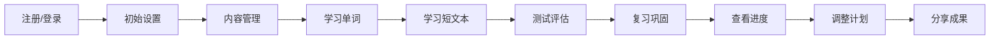

# xpro - 语言学习应用用户故事地图

## 1. 用户故事地图概述
用户故事地图是从用户视角出发，将产品功能按照用户活动流程横向展开，并按照优先级纵向分层的可视化工具。本文档旨在帮助产品团队理解用户如何使用xpro应用，确保产品开发以用户为中心，并与业务目标保持一致。

用户故事地图共分为四个层次：
1. **用户活动（Backbone）**: 高层次的用户活动流
2. **用户任务（Walking Skeleton）**: 每个活动中用户需要完成的具体任务
3. **用户故事（User Stories）**: 详细的用户需求和场景
4. **发布计划（Release Planning）**: 将用户故事映射到产品发布版本

## 2. 用户活动流 (横向)
用户与xpro应用的核心活动流程包括：

### 2.1 活动定义
1. **注册/登录**: 用户创建账户或登录系统
2. **初始设置**: 设置个人学习偏好和目标
3. **内容管理**: 创建、导入、组织学习内容
4. **学习单词**: 使用记忆系统学习单词
5. **学习短文本**: 在上下文中学习短文本
6. **测试评估**: 通过测试验证学习成果
7. **复习巩固**: 系统性复习已学内容
8. **查看进度**: 分析学习数据和进度
9. **调整计划**: 根据进度调整学习计划
10. **分享成果**: 分享学习成就和内容

## 3. 用户任务分解 (纵向)
### 3.1 注册/登录
- **必要任务**:
  - 创建新账户
  - 使用邮箱/手机号登录
  - 重置忘记的密码
  
- **重要任务**:
  - 使用社交账号快速登录
  - 游客模式体验
  - 完善个人资料
  
- **增强任务**:
  - 多设备账号同步
  - 账号安全设置

### 3.2 初始设置
- **必要任务**:
  - 选择学习语言
  - 设置每日学习目标
  - 评估当前语言水平
  
- **重要任务**:
  - 设置学习提醒时间
  - 选择学习内容偏好
  - 自定义界面设置
  
- **增强任务**:
  - 设置详细学习计划
  - 同步日历和提醒系统
  - 学习风格个性化设置

### 3.3 内容管理
- **必要任务**:
  - 创建个人词库
  - 导入词汇列表
  - 选择预设词库
  
- **重要任务**:
  - 添加短文本素材
  - 组织词库分类和标签
  - 编辑词汇详情
  
- **增强任务**:
  - 与他人共享词库
  - 从外部来源自动采集词汇
  - 协作编辑词库

### 3.4 学习单词
- **必要任务**:
  - 查看单词及释义
  - 评价记忆情况
  - 听取单词发音
  
- **重要任务**:
  - 查看单词例句
  - 使用记忆辅助工具
  - 自定义学习会话设置
  
- **增强任务**:
  - 创建词汇关联记忆
  - 自定义单词优先级
  - 记录单词学习笔记

### 3.5 学习短文本
- **必要任务**:
  - 阅读短文本
  - 查看短文翻译
  - 识别关键词汇
  
- **重要任务**:
  - 听读短文本
  - 逐词查看释义
  - 将短文中生词添加到词库
  
- **增强任务**:
  - 上下文分析和语法解析
  - 短文朗读练习与评估
  - 生成相关练习题

### 3.6 测试评估
- **必要任务**:
  - 参与选择题测试
  - 参与拼写测试
  - 查看测试结果
  
- **重要任务**:
  - 完成完形填空测试
  - 创建自定义测试
  - 查看详细错误分析
  
- **增强任务**:
  - 参与游戏化测试
  - 与他人进行测试竞赛
  - 生成个性化测试计划

### 3.7 复习巩固
- **必要任务**:
  - 查看待复习单词
  - 按计划复习单词
  - 重新评价记忆状态
  
- **重要任务**:
  - 集中复习易忘单词
  - 查看记忆曲线变化
  - 调整复习时间间隔
  
- **增强任务**:
  - 设置复习提醒
  - 创建考试冲刺复习
  - 复习模式多样化切换

### 3.8 查看进度
- **必要任务**:
  - 查看每日学习统计
  - 查看整体词汇量进展
  - 查看目标完成情况
  
- **重要任务**:
  - 查看学习时长分析
  - 查看记忆效果评估
  - 查看学习习惯分析
  
- **增强任务**:
  - 查看学习预测分析
  - 查看与同类用户对比
  - 生成学习报告分享

### 3.9 调整计划
- **必要任务**:
  - 调整每日学习目标
  - 修改学习内容优先级
  - 更新学习时间设置
  
- **重要任务**:
  - 根据数据优化学习方法
  - 调整测试和复习频率
  - 管理长期学习目标
  
- **增强任务**:
  - 接收AI优化建议
  - 创建特定场景学习计划
  - 与学习伙伴同步计划

### 3.10 分享成果
- **必要任务**:
  - 查看个人成就
  - 分享学习统计数据
  - 获取成就徽章
  
- **重要任务**:
  - 参与社区排行榜
  - 分享精选词库
  - 邀请好友加入
  
- **增强任务**:
  - 组建学习小组
  - 参与共同挑战
  - 分享学习心得和技巧

## 4. 故事优先级与版本映射
### 4.1 MVP版本 (1.0.0)
关注必要任务和部分重要任务，确保基本用户流程完整。

**必须实现的故事**:
- 作为新用户，我想快速注册账号，以便开始使用应用
- 作为学习者，我想选择我要学习的语言，以便开始学习内容
- 作为学习者，我想创建和导入词库，以便学习自己需要的内容
- 作为学习者，我想通过卡片系统学习单词，以便高效记忆单词
- 作为学习者，我想评价我对单词的记忆程度，以便系统安排适当的复习
- 作为学习者，我想看到系统根据我的评价安排的复习计划，以便巩固记忆
- 作为学习者，我想通过测试检验我的记忆成果，以便确认学习效果
- 作为学习者，我想查看我的学习统计数据，以便了解我的进度
- 作为学习者，我想在不同设备上同步我的学习数据，以便随时随地学习

### 4.2 增长版本 (1.5.0)
关注剩余重要任务和部分增强任务，提升用户体验和留存。

**重点实现的故事**:
- 作为学习者，我想学习短文本中的词汇，以便在上下文中掌握词汇用法
- 作为学习者，我想通过语音听读单词和短文，以便提高发音和听力
- 作为学习者，我想设置和调整我的学习计划，以便更好地管理我的学习
- 作为学习者，我想查看详细的学习分析数据，以便优化我的学习方法
- 作为学习者，我想根据测试结果重点复习我的弱点词汇，以便提高学习效率
- 作为学习者，我想获得成就徽章和激励，以便保持学习动力
- 作为学习者，我想与朋友分享我的学习进度和成就，以便相互激励
- 作为学习者，我想个性化我的学习界面和设置，以便获得更舒适的学习体验

### 4.3 成熟版本 (2.0.0)
关注剩余增强任务，深化产品能力和生态。

**计划实现的故事**:
- 作为学习者，我想获得基于AI的个性化学习建议，以便优化我的学习路径
- 作为学习者，我想与他人协作创建和共享词库，以便共同积累学习资源
- 作为学习者，我想参与社区竞赛和挑战，以便增加学习乐趣和动力
- 作为学习者，我想获得专业领域的特定词汇学习包，以便针对性提升专业能力
- 作为学习者，我想通过多种游戏化方式学习和测试，以便提高学习趣味性
- 作为教师，我想监督和管理我的学生的学习进度，以便提供针对性指导
- 作为机构管理者，我想为团队创建定制化的学习计划，以便统一管理团队学习

## 5. 用户故事全景图
下面是xpro应用的用户故事全景图，将用户活动、任务和版本规划整合在一起：

```mermaid
graph TD
    classDef backbone fill:#d4f1f9,stroke:#333,stroke-width:1px
    classDef walking fill:#e1f7d5,stroke:#333,stroke-width:1px
    classDef stories fill:#fff,stroke:#333,stroke-width:1px
    classDef mvp fill:#ffe6cc,stroke:#333,stroke-width:1px
    classDef growth fill:#fff2cc,stroke:#333,stroke-width:1px
    classDef mature fill:#e6e6e6,stroke:#333,stroke-width:1px
    
    %% 用户活动
    A[用户活动流] -.-> B[注册/登录]
    A -.-> C[内容管理]
    A -.-> D[学习单词]
    A -.-> E[学习短文本]
    A -.-> F[测试评估]
    A -.-> G[复习巩固]
    A -.-> H[查看进度]
    
    %% 注册/登录任务
    B --> B1[创建账户]
    B --> B2[登录系统]
    B --> B3[重置密码]
    
    %% 内容管理任务
    C --> C1[创建词库]
    C --> C2[导入词汇]
    C --> C3[添加短文本]
    
    %% 学习单词任务
    D --> D1[查看卡片]
    D --> D2[评价记忆]
    D --> D3[听取发音]
    
    %% 学习短文本任务
    E --> E1[阅读短文]
    E --> E2[查看翻译]
    E --> E3[学习关键词]
    
    %% 测试评估任务
    F --> F1[选择题测试]
    F --> F2[拼写测试]
    F --> F3[完形填空]
    
    %% 复习巩固任务
    G --> G1[查看待复习]
    G --> G2[按计划复习]
    G --> G3[复习弱点词]
    
    %% 查看进度任务
    H --> H1[查看统计]
    H --> H2[查看目标]
    H --> H3[分析效果]
    
    %% 注册/登录故事
    B1 --> B1S1[注册新账户]:::mvp
    B1 --> B1S2[完善个人资料]:::growth
    B2 --> B2S1[邮箱密码登录]:::mvp
    B2 --> B2S2[社交账号登录]:::growth
    B3 --> B3S1[找回密码]:::mvp
    
    %% 内容管理故事
    C1 --> C1S1[创建个人词库]:::mvp
    C1 --> C1S2[组织词库分类]:::growth
    C2 --> C2S1[导入词汇表]:::mvp
    C2 --> C2S2[编辑词汇详情]:::growth
    C3 --> C3S1[添加短文素材]:::growth
    C3 --> C3S2[自动识别关键词]:::mature
    
    %% 学习单词故事
    D1 --> D1S1[查看单词卡片]:::mvp
    D1 --> D1S2[使用记忆辅助]:::growth
    D2 --> D2S1[评价记忆状态]:::mvp
    D2 --> D2S2[调整优先级]:::growth
    D3 --> D3S1[听取标准发音]:::mvp
    D3 --> D3S2[发音练习]:::mature
    
    %% 版本标注
    MVP[MVP版本 1.0.0]:::mvp
    Growth[增长版本 1.5.0]:::growth
    Mature[成熟版本 2.0.0]:::mature
    
    class A,B,C,D,E,F,G,H backbone
    class B1,B2,B3,C1,C2,C3,D1,D2,D3,E1,E2,E3,F1,F2,F3,G1,G2,G3,H1,H2,H3 walking
    class B1S1,B1S2,B2S1,B2S2,B3S1,C1S1,C1S2,C2S1,C2S2,C3S1,C3S2,D1S1,D1S2,D2S1,D2S2,D3S1,D3S2 stories
```

## 6. 关键用户故事详情
### 6.1 MVP关键故事
#### 用户注册与设置
**故事**: 作为新用户，我想快速创建账户并设置学习偏好，以便开始使用应用进行学习。

**验收标准**:
- 能通过邮箱/手机号完成注册流程
- 能选择学习语言和设置基本学习目标
- 能完成初始水平评估测试
- 注册过程不超过3分钟

#### 词库管理
**故事**: 作为学习者，我想创建、导入和管理我的词库，以便组织我需要学习的内容。

**验收标准**:
- 能创建新词库并添加单词
- 能通过CSV、Excel等格式批量导入单词
- 能为词库添加基本元数据(名称、描述、语言)
- 能浏览和搜索词库中的单词

#### 单词学习
**故事**: 作为学习者，我想通过科学的间隔重复系统学习单词，以便高效记忆更多单词。

**验收标准**:
- 能以卡片方式查看单词、释义、例句
- 能评价记忆情况(1-5级)
- 系统能根据评价安排复习计划
- 能查看单词发音
- 一次学习会话流程连贯直观

#### 复习系统
**故事**: 作为学习者，我想系统提醒我复习之前学过的单词，以便巩固记忆和减少遗忘。

**验收标准**:
- 系统根据间隔重复算法自动安排复习
- 待复习单词明显提示
- 复习过程能重新评价记忆状态
- 复习数据更新记忆曲线

### 6.2 增长版关键故事
#### 短文本学习
**故事**: 作为学习者，我想在上下文中学习单词，以便理解词汇的实际用法和含义。

**验收标准**:
- 能添加和管理短文本素材
- 能在短文中高亮和查看关键词汇
- 能从短文中提取单词添加到词库
- 能进行短文理解和记忆练习

#### 学习数据分析
**故事**: 作为学习者，我想查看详细的学习数据分析，以便了解我的学习效果和优化学习方法。

**验收标准**:
- 展示清晰直观的学习统计图表
- 提供记忆效果分析和遗忘曲线
- 识别学习弱点和难点
- 基于数据提供学习建议

#### 社交分享
**故事**: 作为学习者，我想分享我的学习成果和进度，以便与朋友互相激励和交流。

**验收标准**:
- 能分享学习成就和里程碑
- 能分享特定词库给好友
- 能查看简单的排行榜
- 能邀请朋友一起学习

### 6.3 成熟版关键故事
#### AI个性化学习
**故事**: 作为学习者，我想获得AI提供的个性化学习建议，以便最大化我的学习效率。

**验收标准**:
- AI分析学习数据生成个性化学习路径
- 智能推荐适合的学习内容和方法
- 预测学习成果和进度
- 动态调整建议基于学习行为变化

#### 学习社区
**故事**: 作为学习者，我想参与学习社区，以便交流经验、共享资源和互相激励。

**验收标准**:
- 用户能创建和加入学习小组
- 小组成员能共享词库和学习资源
- 支持讨论和问答
- 支持共同挑战和竞赛
- 社区内容有审核和管理机制 